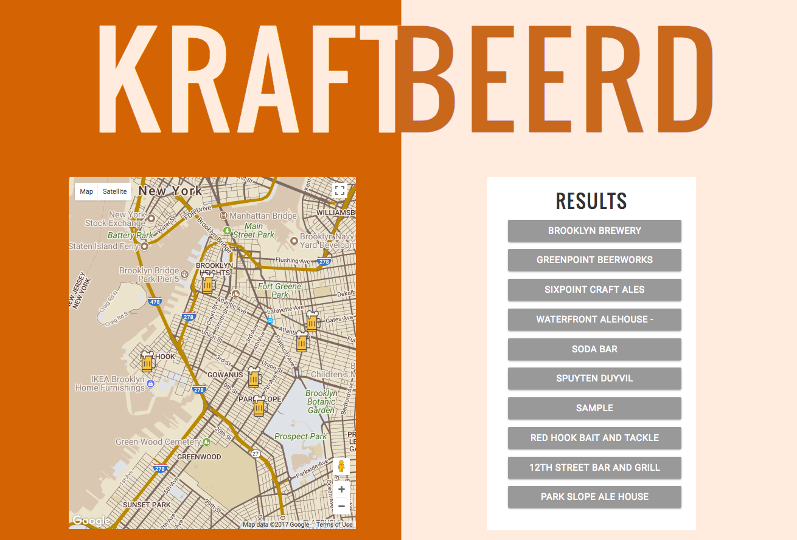
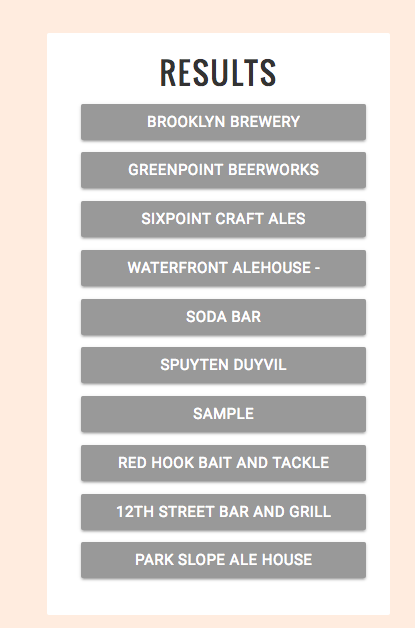
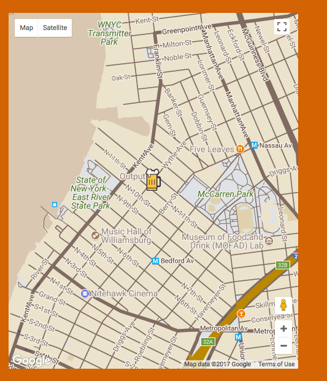
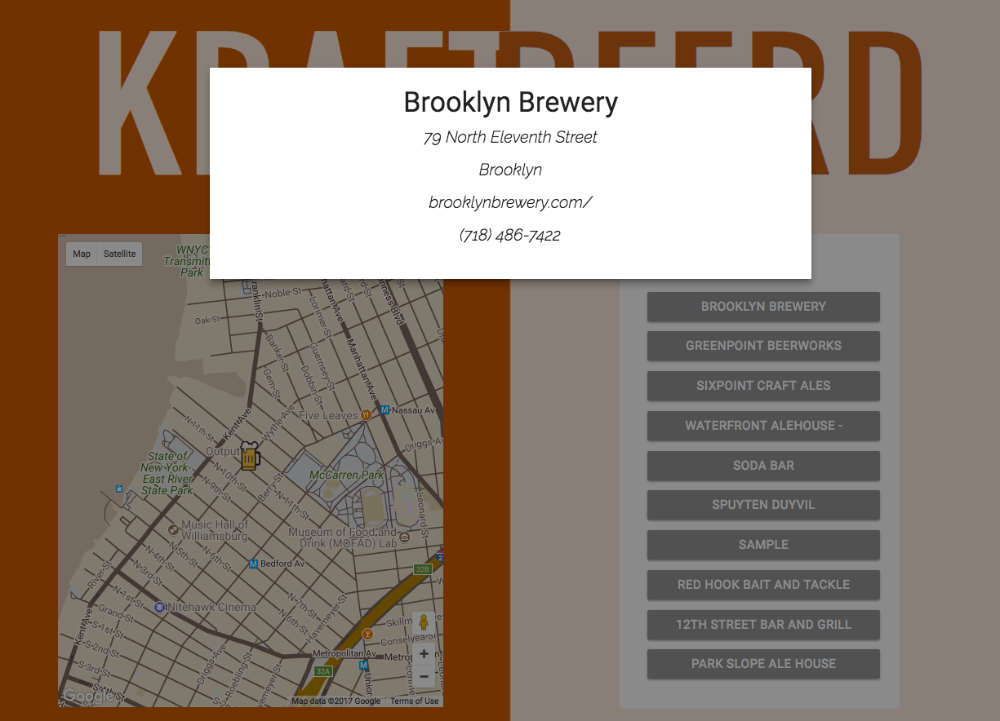

# kraftBeerd

KraftBeerd is a full stack application that was developed as a group project using Google Maps API and displaying results 
to our front-end, so that the user can search for craft beer establishments around the Williamsburg area in New York City. 

  

The text from the buttons are being pulled through an API called "Beer Mapping", which searches for craft beer establishments within certain parameters. 

  

When those buttons are being clicked then a function is invoked that zooms into the map that is displayed on the left side of the page. The marker is a custom marker created by another member of the team and added through the Google API. Along with that a modal pops up with information about that establishment. 

  

  

